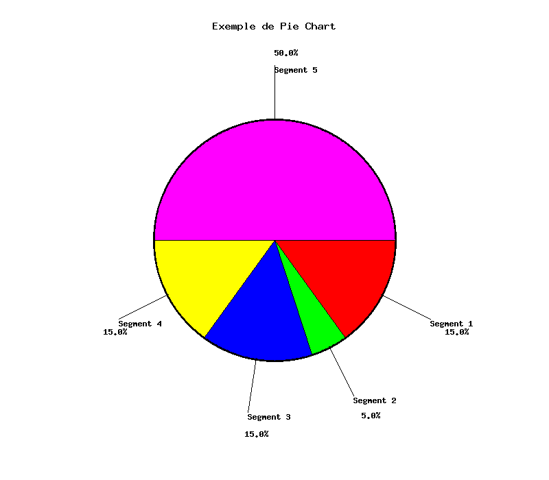

# Création de Pie Chart en langage C avec la bibliothèque GD

Ce programme en langage C utilise la bibliothèque GD pour générer un graphique "Pie Chart" (diagramme circulaire) à partir des données fournies. Le graphique affiche des segments colorés représentant différentes catégories, ainsi que les pourcentages correspondants à côté de chaque segment.

## Prérequis

Avant d'exécuter ce programme, assurez-vous d'avoir les éléments suivants :

1. Un compilateur C pour compiler le code source.
2. La bibliothèque GD installée sur votre système. Si vous ne l'avez pas déjà, vous pouvez l'installer en utilisant la commande suivante (pour Debian/Ubuntu) :

sudo apt-get install libgd-dev

## Constantes

- `IMG_LARGEUR`: Largeur de l'image en pixels.
- `IMG_HAUTEUR`: Hauteur de l'image en pixels.
- `TAILLE_POLICE_TITRE`: Taille de la police pour le titre.
- `TAILLE_POLICE_LABEL`: Taille de la police pour les étiquettes.

## Structure

- `SegmentPie`: Structure pour stocker les données d'un segment de Pie Chart.
  - `pourcentage`: Le pourcentage du segment dans le graphique.
  - `etiquette`: L'étiquette du segment (nom ou description).
  - `couleur[3]`: Tableau pour stocker les composantes RVB (rouge, vert, bleu) de la couleur du segment.

## Fonctions

- `libererEtiquettesSegments`: Fonction pour libérer la mémoire allouée aux étiquettes des segments.
- `creerPieChart`: Fonction pour créer un graphique Pie Chart avec les données fournies et les options de personnalisation.

## Compilation

Pour compiler le programme, exécutez la commande suivante :

gcc -o pie_chart pie_chart.c -lgd -lm

Assurez-vous que la bibliothèque GD est correctement installée et disponible lors de la compilation.

## Utilisation

Après avoir compilé le programme, vous pouvez l'exécuter avec la commande suivante :

./pie_chart <fichier_sortie.png> [0|1]

- `<fichier_sortie.png>` : Le nom du fichier de sortie qui contiendra le graphique Pie Chart généré au format PNG.

- `[0|1]` : Remplacez ici par un `0` si vous voulez que le font de votre graphique soit transparent, sinon, remplacez par un `1` pour avoir la couleur défini dans customBGColor

## Personnalisation

Vous pouvez personnaliser le graphique Pie Chart en modifiant les données des segments dans la fonction `main`. Vous pouvez également ajuster les tailles des polices des titres et des pourcentages en modifiant les variables `labelFontsize` et `titleFontsize` dans la fonction `main` ainsi que changer la couleur du font dans CustomBGColor.

## Exemple de données

Le programme utilise un exemple de données pour générer le graphique Pie Chart. Vous pouvez remplacer ces données par les vôtres en modifiant l'array `segments` dans la fonction `main`.

## Aperçu

Voici un exemple d'image générée par le programme :

## Auteur

Ce programme a été créé par [Roulois Anthony].

